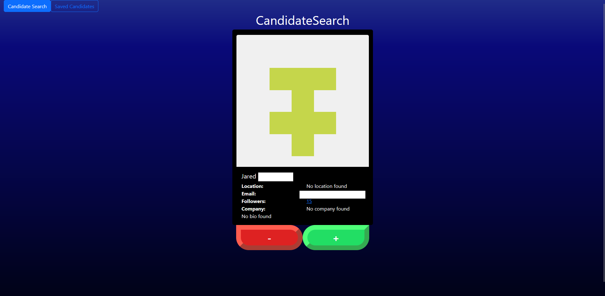
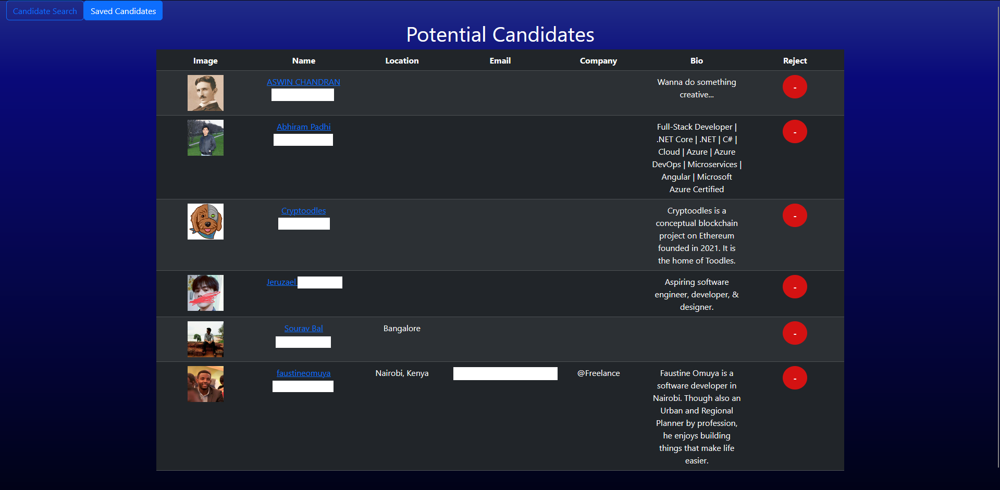

# CodeCrafters

## Table of Contents
- [Description](#Description)
- [Installation](#Installation-Instructions)
- [Usage](#Usage-Instructions)
- [Credits](#Credits)
- [Screenshots](#screenshots)
- [License](#License)
- [Features](#Features)
- [Questions](#Questions)
## Description
CodeCrafters is a project that uses the GitHub API to randomly search through potential candidates to hire to projects. The user will be able to add other users to a list saved in the local browser storage, and find the list in a separate page.
## Installation Instructions
### Requirements
- Your own 'Fine-grained access token` from GitHub
    - To learn how to get one, visit [this page](https://docs.github.com/en/authentication/keeping-your-account-and-data-secure/managing-your-personal-access-tokens#creating-a-fine-grained-personal-access-token)
### Local Hosting
- In a terminal of the project directory, use `npm i` to install the dependencies
- Navigate to the /environment folder, and remove the .EXAMPLE extension of the .env file
- Open the .env file, and enter your GitHub Fine-Grained Access Token as the value of `VITE_GITHUB_TOKEN` variable
    - example: `VITE_GITHUB_TOKEN='{your token here}'`
## Usage Instructions
### Local Hosting
- In a terminal of the project directory, use `npm run build && npm run preview` to build and run the application locally
- In a browser, put `http://localhost:4173/` in the url bar
### Deployed Application
Visit [This Website](https://keithscodecrafters.netlify.app) to use a deployed application
## Credits
- Keith Sialana (Front End React)
- EdX Bootcamp (Code for API requests & Initial Project Files)
## Screenshots
### Candidate Search Page

### Potential Candidates List Page

## License
MIT
## Features
- Random Search of users in GitHub
- Add users to custom list of candidates
- View details of users in saved cadidates list
- Remove candidates from list
## Questions
- [GitHub](https://github.com/keithrsialana)
- [Email](mailto:keith.sialana@hotmail.com)
